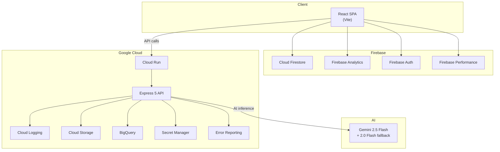

# CarbonWise

**AI-powered carbon footprint awareness platform.** Understand, track, and reduce your carbon footprint through personalized insights powered by Google Gemini AI.

**Live Demo:** [carbonwise-802059347820.us-central1.run.app](https://carbonwise-802059347820.us-central1.run.app)

---

## Problem Statement Alignment

> *Design a solution that helps individuals understand, track, and reduce their carbon footprint through simple actions and personalized insights.*

Climate change is the defining challenge of our generation, yet most people have no idea how much carbon their daily activities produce. CarbonWise bridges this awareness gap with four core features:

| Feature | What it does |
|---|---|
| **Carbon Calculator** | Describe activities in natural language → get instant AI-powered CO₂ estimates with breakdowns |
| **Activity Tracker** | Log daily activities to Firestore → build a personal carbon profile over time |
| **Eco Actions** | Browse category-filtered reduction actions with difficulty levels and annual savings |
| **Personalized Insights** | AI analyzes your tracked data → delivers prioritized recommendations and trends |

---

## Architecture



---

## Google Services Integration (12 Services)

| # | Service | Category | Purpose |
|---|---------|----------|---------|
| 1 | **Gemini 2.5 Flash** | AI/ML | Carbon calculations, insights, and action recommendations |
| 2 | **Cloud Logging** | Observability | Structured production log management via Pino |
| 3 | **Cloud Storage** | Storage | Analytics data export and asset management |
| 4 | **BigQuery** | Analytics | Carbon metrics data warehouse with SQL queries |
| 5 | **Secret Manager** | Security | Secure API key and credential management |
| 6 | **Error Reporting** | Reliability | Production error tracking and alerting |
| 7 | **Cloud Firestore** | Database | Activity tracking and user data persistence |
| 8 | **Firebase Analytics** | Analytics | User engagement and behavior tracking |
| 9 | **Firebase Auth** | Identity | Google Sign-In authentication |
| 10 | **Firebase Performance** | Monitoring | Real User Monitoring (RUM) and web vitals |
| 11 | **Cloud Run** | Compute | Serverless container deployment with auto-scaling |
| 12 | **Google Fonts** | CDN | Inter typeface delivery via preconnect |

---

## Modular Server Architecture

The server uses a **single-responsibility module pattern** — each file has one job, fully documented with JSDoc.

```
server/
├── config.js          # Centralized configuration with env validation
├── constants.js       # HTTP codes, error codes, cache prefixes
├── errors.js          # Custom error hierarchy (AppError → ValidationError, AIServiceError, etc.)
├── logger.js          # Pino structured logger (pino-pretty in dev, JSON in prod)
├── middleware.js       # Helmet CSP, CORS, rate limiting, XSS sanitization, request IDs
├── cache.js           # In-memory response cache with MD5 key generation
├── googleServices.js  # All 6 server-side Google Cloud service integrations
├── schemas.js         # Zod validation schemas for AI response integrity
├── prompts.js         # Gemini system instruction templates
└── routes.js          # API route handlers with dual-model fallback
```

**Key patterns:**
- Centralized error handling with custom error classes
- AI model fallback: tries Gemini 2.5 Flash → falls back to 2.0 Flash on 503/429
- MD5-based response caching to minimize API calls
- Zod schema validation on every AI response
- Graceful shutdown with SIGTERM/SIGINT handlers

---

## Security

| Layer | Implementation |
|---|---|
| HTTP Headers | Helmet.js with strict Content Security Policy |
| Permissions | Permissions-Policy restricts camera, microphone, geolocation |
| CORS | Configurable origin whitelist |
| Rate Limiting | 20 req/min per IP via express-rate-limit |
| Input Sanitization | XSS filtering on all request bodies |
| Schema Validation | Zod validation on all AI responses |
| Request Tracing | UUID v4 on every request via X-Request-Id header |
| Input Limits | Configurable max lengths prevent abuse |
| Content Safety | Gemini safety filters for user input |
| Container | Non-root Docker user, multi-stage build |

---

## Accessibility (WCAG AA)

- Skip-to-content link for keyboard users
- Semantic HTML5 landmarks (`<header>`, `<main>`, `<nav>`, `<footer>`)
- ARIA labels on all interactive elements
- Keyboard navigation with arrow keys, Home/End
- Focus management with visible focus indicators
- Color contrast ratios ≥ 4.5:1
- Screen reader live regions for dynamic content
- `prefers-reduced-motion` support
- `prefers-contrast: high` support
- Minimum touch targets: 44×44px

---

## Testing

**105 tests across 9 test files** — all passing.

| Category | Tests | Coverage |
|---|---|---|
| API Endpoints | 12 | Route handlers, error responses, validation |
| Components | 16 | React Testing Library with jsdom |
| Accessibility | 12 | ARIA attributes, landmarks, keyboard nav |
| Security | 10 | CSP headers, rate limiting, XSS sanitization |
| Schemas | 10 | Zod validation for all AI response schemas |
| Error Classes | 8 | Custom error hierarchy and status codes |
| Google Services | 14 | Cloud Logging, Storage, BigQuery, Error Reporting |
| Edge Cases | 11 | Empty inputs, malformed data, boundary values |
| Constants | 12 | Tab definitions, categories, impact levels |

```bash
npm test              # Run all 105 tests
npx vitest --coverage # Run with coverage report
```

---

## Quick Start

```bash
# Clone and install
git clone https://github.com/Hmpunith/CarbonWise.git
cd CarbonWise
npm install

# Add your Gemini API key
cp .env.example .env
# Edit .env → set GEMINI_API_KEY

# Start development
npm run dev
# → Frontend: http://localhost:5173
# → API:      http://localhost:8080
```

| Script | Description |
|---|---|
| `npm run dev` | Start Vite + Express concurrently |
| `npm run build` | Production build |
| `npm start` | Production server |
| `npm test` | Run 105 tests |
| `npm run lint` | ESLint check |
| `npm run format` | Prettier format |

---

## Deployment

Deployed on **Google Cloud Run** with continuous deployment from GitHub.

```bash
# Manual deploy
gcloud builds submit --tag gcr.io/PROJECT_ID/carbonwise
gcloud run deploy carbonwise \
  --image gcr.io/PROJECT_ID/carbonwise \
  --platform managed \
  --region us-central1 \
  --allow-unauthenticated \
  --set-env-vars "NODE_ENV=production,GEMINI_API_KEY=your-key"
```

Docker multi-stage build produces a minimal production image (~150MB).

---

## License

MIT © 2026 CarbonWise
