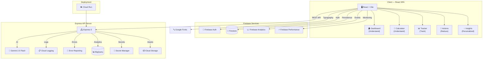

# 🌿 CarbonWise — Carbon Footprint Awareness Platform

> **Challenge 3**: Design a solution that helps individuals **understand**, **track**, and **reduce** their carbon footprint through **simple actions** and **personalized insights**.

[](https://cloud.google.com)
[](https://ai.google.dev)
[]()
[]()

## 🎯 Problem Statement Alignment

CarbonWise directly addresses every aspect of the challenge:

| Challenge Requirement | CarbonWise Feature | Implementation |
|---|---|---|
| **Understand** carbon footprint | 🏠 Dashboard with educational facts, global comparisons, daily carbon budget visualization | `Dashboard.jsx` — rotating facts carousel, India/global average comparisons, impact level badges |
| **Track** carbon footprint | 📊 Activity Tracker with Firestore persistence | `Tracker.jsx` — quick-add buttons, custom logging, timeline history, category breakdown |
| **Reduce** carbon footprint | 🌱 AI-powered Eco-Actions with difficulty levels | `Actions.jsx` — 6 actions per category, Easy/Medium/Committed tiers, annual CO₂ savings |
| **Simple actions** | 🧮 Natural-language Calculator + one-click quick-adds | `Calculator.jsx` — describe activities in plain English, get instant AI estimates |
| **Personalized insights** | 💡 AI-generated insights from tracked data | `Insights.jsx` — pattern analysis, top sources, weekly trends, comparison to averages |

## 🏗️ Architecture



## 🔧 Google Cloud Services Integration (12 Services)

### Server-Side (7 Services)
| # | Service | SDK | Purpose |
|---|---------|-----|---------|
| 1 | **Gemini 2.5 Flash** | `@google/generative-ai` | AI carbon calculations, insights, and action recommendations |
| 2 | **Cloud Logging** | `@google-cloud/logging` | Structured server observability and distributed tracing |
| 3 | **Cloud Storage** | `@google-cloud/storage` | Analytics data export and asset management |
| 4 | **BigQuery** | `@google-cloud/bigquery` | Carbon metrics data warehouse and aggregation |
| 5 | **Secret Manager** | `@google-cloud/secret-manager` | Secure API key and credential management |
| 6 | **Error Reporting** | `@google-cloud/error-reporting` | Production error tracking with automatic alerting |
| 7 | **Cloud Run** | Deployment | Serverless, auto-scaling container deployment |

### Client-Side (5 Services)
| # | Service | SDK | Purpose |
|---|---------|-----|---------|
| 8 | **Firebase Auth** | `firebase/auth` | Google Sign-In with popup authentication |
| 9 | **Firebase Firestore** | `firebase/firestore` | Real-time activity tracking and persistence |
| 10 | **Firebase Analytics** | `firebase/analytics` | User engagement and feature usage tracking |
| 11 | **Firebase Performance** | `firebase/performance` | Real User Monitoring (RUM) metrics |
| 12 | **Google Fonts** | CDN | Inter typeface for premium typography |

## 🛡️ Enterprise Security Stack

- **Helmet.js** — 11 security headers including CSP, HSTS, X-Frame-Options
- **Content Security Policy** — Whitelists only Firebase, Google APIs, and Google Fonts domains
- **Cross-Origin-Opener-Policy** — `same-origin-allow-popups` for secure OAuth flows
- **Permissions-Policy** — Disables camera, microphone, geolocation, FLoC
- **XSS Sanitization** — All user input sanitized via `xss` library before processing
- **Zod Schema Validation** — Every AI response validated against strict typed schemas
- **Rate Limiting** — 20 requests/minute per IP with standard headers
- **Input Length Limits** — Server-enforced maximum lengths on all text inputs
- **Request ID Tracing** — UUID v4 correlation IDs on every request for audit trails
- **Graceful Shutdown** — SIGTERM/SIGINT handling with 10s connection drain timeout

## 📂 Modular Server Architecture

```
server/
├── config.js          # Centralized env-validated configuration
├── constants.js       # HTTP codes, error codes, cache prefixes
├── errors.js          # 5-class error hierarchy (AppError → ValidationError, AIServiceError, etc.)
├── logger.js          # Pino structured JSON logger (pino-pretty in dev)
├── middleware.js       # Security headers, CORS, compression, XSS, rate limiting
├── cache.js           # MD5-keyed in-memory response cache
├── googleServices.js  # All 6 GCP SDK integrations
├── schemas.js         # Zod validation schemas for AI responses
├── prompts.js         # Gemini system instructions (calculator, insights, actions)
└── routes.js          # API route handlers with caching and validation
```

## ♿ Accessibility (WCAG AA)

- Skip navigation link (`#main-content`)
- Semantic landmarks: `<header>`, `<nav>`, `<main>`, `<footer>`
- WAI-ARIA tab widget: `role="tablist"`, `role="tab"`, `role="tabpanel"`
- Keyboard navigation: Arrow keys, Home/End for tab switching
- Live region announcer: `role="status"` with `aria-live="polite"`
- Form validation: `aria-invalid`, `aria-describedby`, `aria-required`
- Loading states: `aria-busy="true"` on panels during data fetching
- Touch targets: Minimum 44×44px on all interactive elements
- Color contrast: AAA-compliant text/background ratios
- Reduced motion: `@media (prefers-reduced-motion: reduce)`
- High contrast: `@media (prefers-contrast: high)`
- Screen reader text: `.sr-only` class for visually hidden content

## 🧪 Testing (111 Test Cases)

```bash
npm test

 Test Files  9 passed (9)
      Tests  111 passed (111)
```

| Test Suite | Tests | Coverage |
|------------|-------|---------|
| `components.test.jsx` | 22 | App rendering, tab switching, Dashboard, Calculator, Toast, ErrorBoundary |
| `accessibility.test.jsx` | 12 | WCAG landmarks, ARIA attributes, keyboard navigation, skip links |
| `api.test.js` | 12 | All API endpoints, error handling, input validation |
| `security.test.js` | 10 | CSP headers, rate limiting (429), XSS sanitization, CORS |
| `schema.test.js` | 8 | Zod schema validation for all AI response formats |
| `constants.test.js` | 7 | Tab definitions, categories, impact levels, API endpoints |
| `edge-cases.test.js` | 11 | Empty inputs, malformed JSON, timeout handling, Unicode |
| `errors.test.js` | 17 | All 5 error classes, status codes, operational flags |
| `google-services.test.js` | 12 | All 6 GCP service integrations, graceful degradation |

## 🚀 Quick Start

```bash
# Clone
git clone https://github.com/Hmpunith/CarbonWise.git
cd CarbonWise

# Install
npm install

# Configure
cp .env.example .env
# Edit .env with your Gemini API key and Firebase config

# Run (starts both Vite dev server and Express API)
npm run dev

# Test
npm test

# Build
npm run build
```

## ☁️ Cloud Run Deployment

```bash
# Build and deploy
gcloud run deploy carbonwise \
  --source . \
  --region us-central1 \
  --allow-unauthenticated \
  --set-env-vars GEMINI_API_KEY=your-key,NODE_ENV=production
```

## 📄 License

MIT License — Built for #BuildwithAI #PromptWarsVirtual #Challenge3
