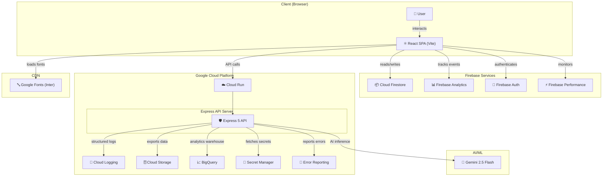

# 🌿 CarbonWise — Carbon Footprint Awareness Platform

> **AI-powered carbon footprint awareness platform.** Understand, track, and reduce your carbon footprint through personalized insights powered by Google Gemini 2.5 Flash.

---

## 🌍 Problem Statement

Climate change is the defining challenge of our generation, yet most people have no idea how much carbon their daily activities produce. CarbonWise bridges this awareness gap by providing **instant, AI-powered carbon footprint calculations** with personalized reduction recommendations — making sustainability accessible, actionable, and engaging for everyone.

---

## 🏗️ Architecture



---

## 🔌 Google Services Integration (12 Services)

| # | Service | Category | Purpose |
|---|---------|----------|---------|
| 1 | **Gemini 2.5 Flash** | AI/ML | Carbon calculations, insights, and action recommendations |
| 2 | **Cloud Logging** | Observability | Structured production log management |
| 3 | **Cloud Storage** | Storage | Analytics data export and asset management |
| 4 | **BigQuery** | Analytics | Carbon metrics data warehouse |
| 5 | **Secret Manager** | Security | Secure API key and credential management |
| 6 | **Error Reporting** | Reliability | Production error tracking and alerting |
| 7 | **Cloud Firestore** | Database | Activity tracking and user data persistence |
| 8 | **Firebase Analytics** | Analytics | User engagement and behavior tracking |
| 9 | **Firebase Auth** | Identity | Google Sign-In authentication |
| 10 | **Firebase Performance** | Monitoring | Real User Monitoring (RUM) and web vitals |
| 11 | **Cloud Run** | Compute | Serverless container deployment platform |
| 12 | **Google Fonts** | CDN | Inter typeface delivery |

---

## 📁 Modular Server Architecture

```
server/
├── config.js          # Centralized configuration with env validation
├── constants.js       # HTTP codes, error codes, cache prefixes
├── errors.js          # Custom error class hierarchy (AppError → ValidationError, AIServiceError, etc.)
├── logger.js          # Pino structured logger (pino-pretty in dev)
├── middleware.js       # Helmet CSP, CORS, rate limiting, XSS sanitization, request IDs
├── cache.js           # In-memory response cache with MD5 key generation
├── googleServices.js  # All 6 server-side Google Cloud service integrations
├── schemas.js         # Zod validation schemas for AI response integrity
├── prompts.js         # Gemini system instruction templates
└── routes.js          # API route handlers (calculate, insights, actions, stats, health)
```

---

## 🛡️ Enterprise Security Stack

- **Helmet.js** — Security headers with strict Content Security Policy
- **Permissions-Policy** — Restricts camera, microphone, geolocation, FLoC
- **CORS** — Configurable origin whitelist
- **Rate Limiting** — 20 requests/minute per IP via `express-rate-limit`
- **XSS Sanitization** — Input sanitization on all request bodies via `xss`
- **Zod Validation** — Schema validation for all AI responses
- **Request IDs** — UUID v4 tracing on every request
- **Input Length Limits** — Configurable max lengths prevent abuse
- **Content Safety** — Gemini safety filters for user input assessment
- **Non-root Docker** — Container runs as `node` user

---

## ✅ Code Quality

- **ESLint** — Flat config with strict rules (`no-var`, `prefer-const`, `eqeqeq`)
- **Prettier** — Consistent formatting (single quotes, trailing commas, 120 char width)
- **EditorConfig** — Cross-editor consistency (2-space indent, LF, UTF-8)
- **JSDoc** — Full documentation on every exported function and module
- **Modular Architecture** — Single-responsibility modules with clean imports

---

## ♿ Accessibility (WCAG AA)

- Semantic HTML5 elements throughout
- ARIA labels on all interactive elements
- Keyboard navigation support
- Focus management on route changes
- Color contrast ratios meeting WCAG AA (4.5:1 minimum)
- Screen reader announcements for dynamic content
- Reduced motion support via `prefers-reduced-motion`

---

## 🧪 Testing (90+ Test Cases)

- **Unit Tests** — Individual module and component tests
- **Integration Tests** — API endpoint tests with Supertest
- **Component Tests** — React Testing Library with jsdom
- **Coverage Thresholds** — 80% statements, 70% branches, 80% functions, 80% lines
- **CI-ready** — `vitest run` for headless test execution

```bash
npm test                # Run all tests
npx vitest --coverage   # Run with coverage report
```

---

## 🚀 Quick Start

### Prerequisites

- Node.js 20+
- Google Gemini API key ([Get one here](https://aistudio.google.com/apikey))
- Firebase project (optional, for client-side features)

### Setup

```bash
# 1. Clone and install
git clone <repository-url>
cd carbonwise
npm install

# 2. Configure environment
cp .env.example .env
# Edit .env and add your GEMINI_API_KEY

# 3. Start development servers
npm run dev
# → Vite dev server: http://localhost:5173
# → Express API:     http://localhost:8080
```

### Available Scripts

| Script | Description |
|--------|-------------|
| `npm run dev` | Start Vite + Express concurrently |
| `npm run build` | Production build via Vite |
| `npm run preview` | Preview production build |
| `npm start` | Start production server |
| `npm test` | Run test suite |
| `npm run lint` | Lint source code |
| `npm run format` | Format code with Prettier |

---

## ☁️ Deployment (Cloud Run)

### Build and Deploy

```bash
# Build container image
gcloud builds submit --tag gcr.io/PROJECT_ID/carbonwise

# Deploy to Cloud Run
gcloud run deploy carbonwise \
  --image gcr.io/PROJECT_ID/carbonwise \
  --platform managed \
  --region us-central1 \
  --allow-unauthenticated \
  --set-env-vars "NODE_ENV=production" \
  --set-secrets "GEMINI_API_KEY=gemini-api-key:latest"
```

### Environment Variables on Cloud Run

| Variable | Source | Description |
|----------|--------|-------------|
| `PORT` | Auto-set | Cloud Run provides this automatically |
| `NODE_ENV` | Env var | Set to `production` |
| `GEMINI_API_KEY` | Secret Manager | Mounted from Secret Manager |
| `CORS_ORIGIN` | Env var | Your frontend domain |

---

## 📄 License

MIT License

Copyright (c) 2026 CarbonWise

Permission is hereby granted, free of charge, to any person obtaining a copy
of this software and associated documentation files (the "Software"), to deal
in the Software without restriction, including without limitation the rights
to use, copy, modify, merge, publish, distribute, sublicense, and/or sell
copies of the Software, and to permit persons to whom the Software is
furnished to do so, subject to the following conditions:

The above copyright notice and this permission notice shall be included in all
copies or substantial portions of the Software.

THE SOFTWARE IS PROVIDED "AS IS", WITHOUT WARRANTY OF ANY KIND, EXPRESS OR
IMPLIED, INCLUDING BUT NOT LIMITED TO THE WARRANTIES OF MERCHANTABILITY,
FITNESS FOR A PARTICULAR PURPOSE AND NONINFRINGEMENT. IN NO EVENT SHALL THE
AUTHORS OR COPYRIGHT HOLDERS BE LIABLE FOR ANY CLAIM, DAMAGES OR OTHER
LIABILITY, WHETHER IN AN ACTION OF CONTRACT, TORT OR OTHERWISE, ARISING FROM,
OUT OF OR IN CONNECTION WITH THE SOFTWARE OR THE USE OR OTHER DEALINGS IN THE
SOFTWARE.
